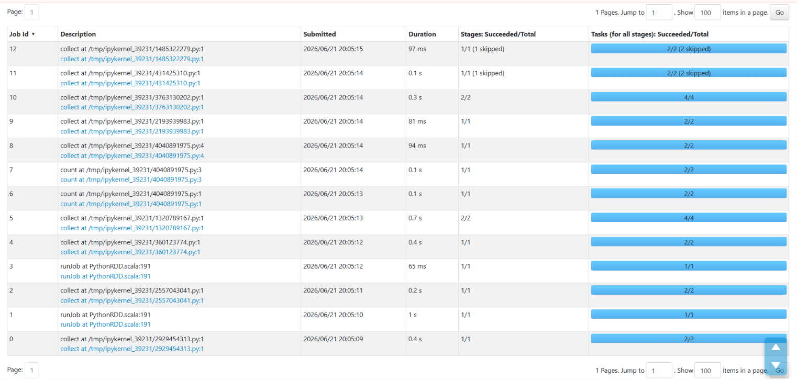

# PySpark RDD Data Processing Lab

A hands-on Apache Spark project focused on processing structured text datasets using low-level Resilient Distributed Dataset (RDD) APIs. This project demonstrates core distributed data engineering patterns including structured splitting, data cleansing, functional transformations and aggregation tracking via the Spark Web UI.

## Features

* **Data Parsing & Map Transformations:**
  Structured extraction of raw text fields into strongly-typed key-value pair attributes.

* **Aggregations & Key Reductions:**
  Counting occurrences across categorical attributes (such as department listings) using reduceByKey transformations.

* **Dynamic Data Quality Filtering:**
  Advanced multi-stage integrity validation using custom exceptions and numeric data evaluations to isolate and drop corrupted records.

* **Lineage & Performance Profiling:**
  Monitoring Directed Acyclic Graph (DAG) structures and task optimization utilizing the Spark Web UI tracking port.

## 📁 Repository Structure

```text
├── rdd_lab.ipynb      # Main Jupyter Notebook containing the task execution cells
├── employees.txt      # Raw comma-separated text data containing worker records
└── README.md          # Project documentation
```

## 🛠️ Prerequisites & Setup

Ensure you have a configured Python environment with Apache Spark and Java runtime dependencies available.

### 1. Install PySpark

```bash
pip install pyspark
```

### 2. Run the Notebook

Open `rdd_lab.ipynb` inside your preferred interactive environment (e.g., VS Code, GitHub Codespaces, or JupyterLab) and ensure your Python kernel is mapped correctly to your environment.

### 3. Monitor Execution Summary

Forward or open port `4040` on your host machine during runtime to explore job history, stages, and execution timelines inside the native Spark Web UI.

## Execution Monitoring

```markdown



```

This visualizations helps demonstrate Spark job execution, stage progression, DAG lineage and performance metrics during processing.

## Learning Outcomes

Through this lab i gain practical experience with:

* Spark RDD transformations and actions
* Distributed data processing concepts
* Data cleansing and validation pipelines
* Aggregation using reduceByKey
* Spark DAG execution and lineage tracking
* Spark Web UI monitoring and performance analysis

## Technologies Used

* Apache Spark (PySpark)
* Python
* Jupyter Notebook
* Spark Web UI
